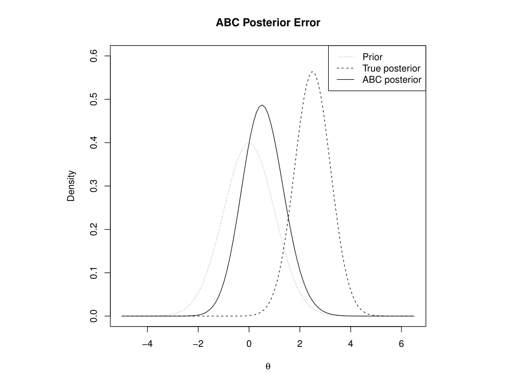

Approximate Bayesian Computation is a Monte Carlo method that is rather naïve, because in its basic form it does not use any assumptions about the distributions involved, outside of the prior densities and the model process. This naiveté results in computational inefficiency, but means ABC can be applied to problems that are not yet well understood enough for more sophisticated methods.
However, one complication is that the algorithm requires a tolerance parameter, which determines how forgiving it is about simulation data being different from the original observations. Setting this parameter is a balance between bias introduced by being overly forgiving, and Monte Carlo error introduced by being too unforgiving, and not being left with enough simulated samples.
Outside of looking at particular model cases, this rapidly becomes a problem that requires use of asymptotics, where we look at the behaviour of the error, and the optimal choice of tolerance, as the amount of computation time for generating samples tends to infinity. The results can differ, depending on which variant of ABC is being used.
